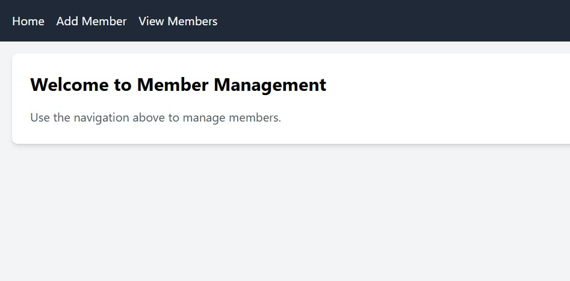
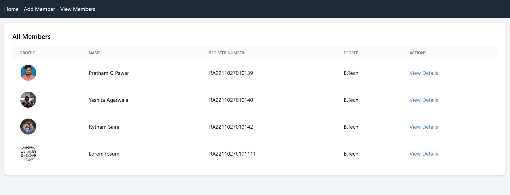

# Team-Management-App

# 👥 Team Members Management Application

A responsive MERN-stack application to manage student or team member profiles with authentication, CRUD operations, and advanced features.

---
🔗 Live Demo: https://team-management-app-xl3r.onrender.com/

🔗 GitHub Repo: https://github.com/pratham07816/Team-Management-App

---

## 🚀 Features

### 🔐 Authentication
- User registration and login
- JWT-based authentication
- Protected routes

### ✅ Member Management (CRUD)
- Add new members with profile images
- View all registered members in a tabular format
- Edit member details
- Delete members
- View detailed member information

### 🔍 Advanced Features
- Search members by name or register number
- Filter members by degree
- Responsive UI with Tailwind CSS

---

## 🖼️ Screenshots

### 📌 Home Page



### 📌 Add Member Page


### 📌 View Members Page



### 📌 View Details Page


---

## 🛠️ Tech Stack

- **Frontend**: React.js + Tailwind CSS
- **Backend**: Node.js + Express
- **Database**: MongoDB
- **Authentication**: JWT
- **HTTP Client**: Axios

---

## 📋 Setup Instructions

### Prerequisites
- Node.js (v14 or higher)
- MongoDB (local or Atlas)
- npm or yarn

### Backend Setup
1. Navigate to the server directory:
   ```bash
   cd server
   ```

2. Install dependencies:
   ```bash
   npm install
   ```

3. Create a `.env` file in the server directory:
   ```
   JWT_SECRET=your_super_secret_jwt_key_here
   MONGODB_URI=your_mongodb_connection_string
   PORT=3001
   ```

4. Start the backend server:
   ```bash
   npm start
   ```

### Frontend Setup
1. Navigate to the client directory:
   ```bash
   cd client
   ```

2. Install dependencies:
   ```bash
   npm install
   ```

3. Start the frontend development server:
   ```bash
   npm start
   ```

4. Open [http://localhost:3000](http://localhost:3000) in your browser.

---

## 🔌 API Endpoints

| Method | Endpoint | Description | Auth Required |
|------|---------|------------|--------------|
| POST | /api/auth/register | Register new user | ❌ |
| POST | /api/auth/login | Login user | ❌ |
| GET | /api/members | Fetch all members | ✅ |
| GET | /api/members/:id | Get member details | ✅ |
| POST | /api/members | Add new member | ✅ |
| PUT | /api/members/:id | Update member | ✅ |
| DELETE | /api/members/:id | Delete member | ✅ |

---

## 🔐 Authentication Flow

1. User registers or logs in via `/login` or `/register`
2. JWT token is stored in sessionStorage for enhanced security
3. Token is automatically attached to API requests
4. Protected routes redirect to login if no token
5. Logout clears token and redirects to login

---

## 📈 Scaling Notes

- **Database**: MongoDB Atlas for cloud scaling
- **File Storage**: Consider cloud storage (AWS S3, Cloudinary) for profile images
- **Authentication**: Implement refresh tokens for better security
- **Caching**: Add Redis for session management
- **Load Balancing**: Use nginx or similar for multiple server instances
- **Monitoring**: Add logging and error tracking (Winston, Sentry)

---

## 🤝 Contributing

1. Fork the repository
2. Create a feature branch
3. Commit your changes
4. Push to the branch
5. Open a Pull Request

---

## 📄 License

This project is licensed under the MIT License.


